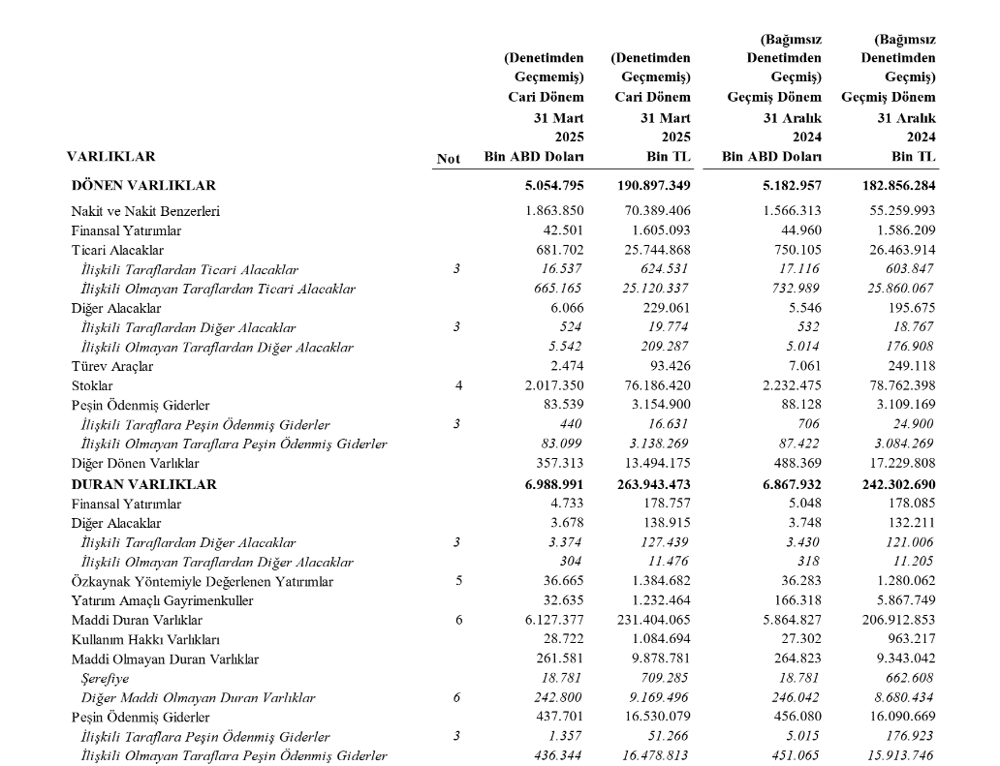
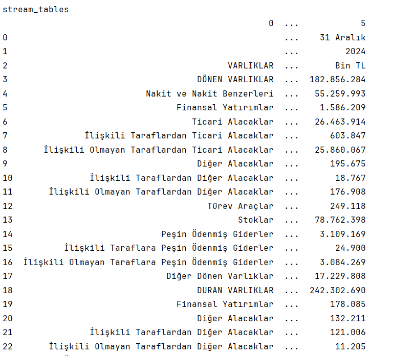
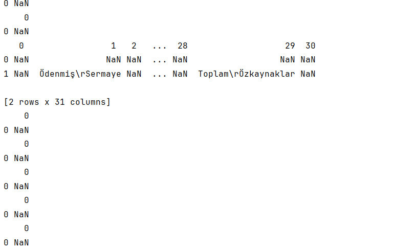
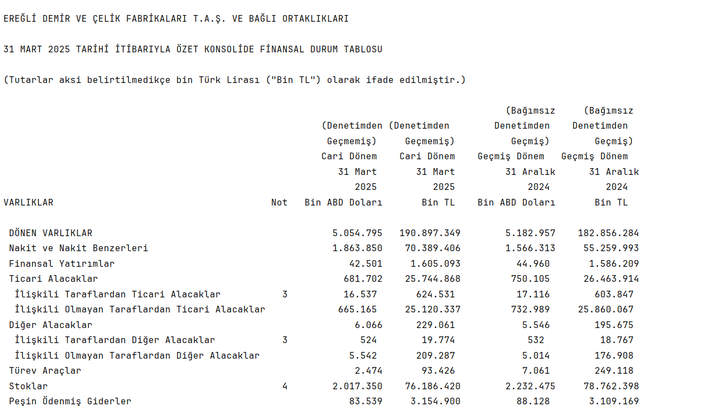

# 🧾 extract_tables_from_pdfs

Bu proje, PDF belgelerindeki tabloları otomatik olarak çıkartmak için üç farklı yaklaşımı karşılaştırmalı olarak sunar:

- 🧱 Camelot (`lattice` & `stream` modlarıyla)
- 🪶 pdfplumber (hassas hizalama stratejileriyle)
- 🤖 LLMWhisperer (Unstract API tabanlı yapay zeka destekli metin çıkarımı)
- 📊 Tabula (Java tabanlı güçlü tablo çıkarıcı)

---

## 🎯 Amaç

PDF tabanlı raporlar, fatura dokümanları veya resmi belgelerden tablo verilerini güvenilir ve tekrar edilebilir bir biçimde çıkarmak.  
Bu repo, farklı yöntemlerin çıktılarının karşılaştırılması için temel bir altyapı sağlar.

---

## 📁 Proje Yapısı

Proje, PDF belgelerinden tablo verilerini çıkarmak için kullanılan dört farklı Python betiğinden oluşur. Her bir betik, farklı bir kütüphane veya yöntem kullanarak tablo çıkarımını gerçekleştirir ve `eregli_rapor.pdf` dosyasını işler. Aşağıda proje dosyalarının açıklamaları yer almaktadır:

- **`pdfplumberr.py`**: pdfplumber kütüphanesini kullanarak PDF'deki tabloları çıkarır. `vertical_strategy` ve `horizontal_strategy` ayarlarıyla metin tabanlı hizalamayı optimize eder. Çıkarılan tablolar pandas DataFrame formatında ekrana yazdırılır.
- **`tabulaa.py`**: Tabula kütüphanesini kullanarak PDF'deki tabloları çıkarır. `lattice` ve `stream` modlarını destekler; bu betikte her iki mod da kullanılmıştır. Çıkarılan tablolar pandas DataFrame olarak işlenir ve ekrana yazdırılır.
- **`llmwhisperer.py`**: Unstract'ın LLMWhisperer API'sini kullanarak PDF'den metin çıkarımı yapar. Tabloları doğrudan ayıklama yerine, yapay zeka destekli metin çıkarımı gerçekleştirir ve sonuçları metin formatında döndürür.
- **`camelott.py`**: Camelot kütüphanesini kullanarak PDF'deki tabloları çıkarır. Hem `lattice` hem de `stream` modlarıyla çalışır. Çıkarılan tablolar pandas DataFrame formatında ekrana yazdırılır.

## 🚀 Kurulum

Aşağıdaki adımları izleyerek projeyi yerel ortamınıza kurabilir ve çalıştırabilirsiniz.

### 1. Gereksinimler
Projenin çalışması için aşağıdaki bağımlılıkların yüklü olması gerekir:

```bash
pip install pdfplumber pandas tabula-py camelot-py unstract-llmwhisperer python-dotenv
```

# Not: Camelot ve Tabula için Java'nın sistemde yüklü olması gerekir. Java'nın yüklü olduğundan emin olun:
Java'nın yüklü olup olmadığını kontrol etmek için: java -version
Java'yı yüklemek için: Java SE İndirme Sayfası
Ayrıca, llmwhisperer.py betiği için Unstract API anahtarına ihtiyacınız var. .env dosyasına aşağıdaki gibi API anahtarınızı ekleyin:

```bash
API_KEY=your_unstract_api_key_here
```

# PDF Dosyası
Projenin çalışması için eregli_rapor.pdf dosyasının proje dizininde bulunması gerekir. Bu dosya, tablo çıkarımı için kullanılacak örnek PDF belgesidir.

Aşağıda, `eregli_rapor.py` örnek bir tablo vardır :




# 🛠 Kullanım
Her bir betiği ayrı ayrı çalıştırarak tablo çıkarım sonuçlarını görebilirsiniz. Betikleri çalıştırmak için aşağıdaki komutları kullanın:

```bash
python pdfplumberr.py
python tabulaa.py
python llmwhisperer.py
python camelott.py
```
Her betik, PDF'deki tabloları kendi yöntemine göre çıkarır ve sonuçları konsola yazdırır. Çıktılar pandas DataFrame veya metin formatında olacaktır.

## 📊 Örnek Çıktı
Aşağıda, `camelot` ile çıkarılan bir tablonun görsel bir örneği yer almaktadır:



Aşağıda, `tabula` ile çıkarılan bir tablonun görsel bir örneği yer almaktadır:



Aşağıda, `pdfplumber` ile çıkarılan bir tablonun görsel bir örneği yer almaktadır:


Aşağıda, `llmwhisperer` ile çıkarılan bir tablonun görsel bir örneği yer almaktadır:




## 📝 Sonuçlar ve Öneriler

- **Düzenli Tablolar**: Camelot (`lattice`) ve Tabula, düzenli ve net sınırları olan tablolarda en iyi performansı gösterir.
- **Düzensiz Tablolar**: pdfplumber ve Camelot (`stream`) daha esnek yapılandırma sunar, ancak doğruluk tablonun yapısına bağlıdır.
- **Metin + Tablo**: LLMWhisperer, tablo dışı metinleri de çıkarmak için idealdir.
- **Performans**: pdfplumber en hafif ve hızlı çözümdür, ancak karmaşık tablolarda ek ayar gerektirebilir.

Farklı kullanım senaryolarına bağlı olarak her yöntemin avantajları olsa da, yapılan testlerde **LLMWhisperer** genellikle en tutarlı ve kapsamlı sonuçları sağlamıştır. Bu nedenle, hem tablo hem de metin çıkarımı gereken durumlarda LLMWhisperer öncelikli olarak değerlendirilebilir. Hangi yöntemin seçileceği, PDF'nin yapısına, tablo düzenine ve projenin ihtiyaçlarına bağlıdır. 

